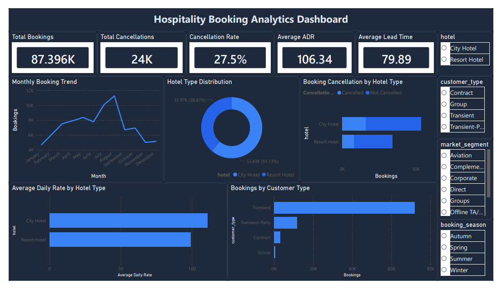
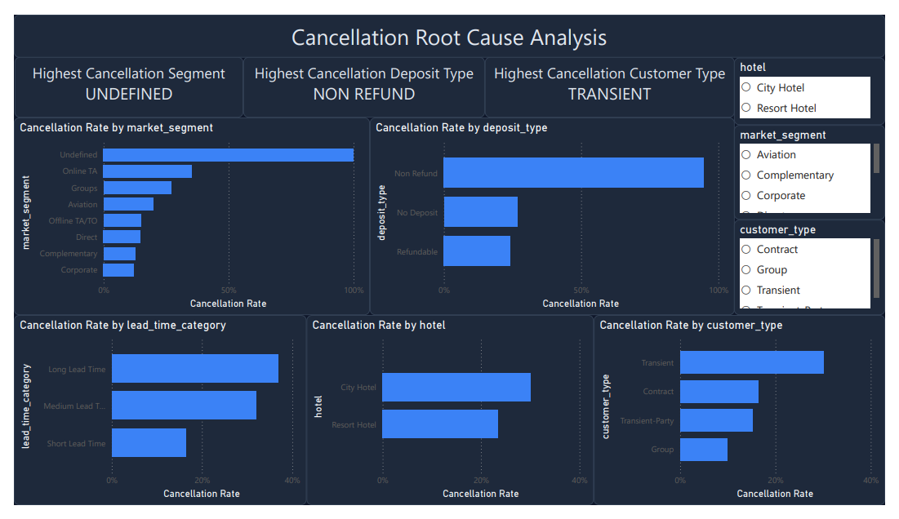

# Hospitality Booking Analytics Dashboard

## Project Overview

This project analyzes hotel booking behavior, cancellation patterns, customer segments, and pricing metrics using Python, SQL concepts, and Power BI.

The objective is to uncover booking trends, identify key cancellation drivers, and build an interactive dashboard for business decision-making.

---

## Dashboard Preview

### Executive Overview



### Cancellation Root Cause Analysis



## Dataset

Hotel Booking Demand Dataset

- ~119,000 hotel booking records
- City Hotel and Resort Hotel bookings
- Reservation, customer, pricing, and cancellation information

---

## Tools & Technologies

- Python
- Pandas
- NumPy
- Matplotlib
- Seaborn
- Power BI
- Git
- GitHub

---

## Project Workflow

1. Data Cleaning
2. Exploratory Data Analysis
3. Feature Engineering
4. Predictive Modeling
5. Dashboard Dataset Creation
6. Power BI Dashboard Development
7. Insight Generation
8. Reporting & Documentation

---

## Machine Learning Models

The following models were trained to predict hotel booking cancellations:

- Logistic Regression
- Random Forest Classifier

Evaluation metrics:

- Accuracy Score
- Classification Report
- Confusion Matrix

## Dashboard Pages

### Page 1 — Hospitality Booking Analytics Dashboard

- KPI Cards
- Monthly Booking Trend
- Hotel Type Distribution
- Booking Cancellation Analysis
- ADR Analysis
- Customer Type Analysis

### Page 2 — Cancellation Root Cause Analysis

- Highest Cancellation Segment
- Highest Cancellation Deposit Type
- Highest Cancellation Customer Type
- Cancellation Rate by Market Segment
- Cancellation Rate by Deposit Type
- Cancellation Rate by Lead Time Category
- Cancellation Rate by Hotel Type
- Cancellation Rate by Customer Type

---

## Key Insights

- Non-Refund bookings had the highest cancellation rate.
- Long lead-time bookings were more likely to cancel.
- City Hotels showed higher cancellation rates.
- Transient customers accounted for the majority of cancellations.
- August recorded the highest booking volume.

---

## Repository Structure

```text
dashboard/
data/
docs/
notebooks/
reports/
sql/
visuals/
README.md
```

## Author

Ayushi Dhimmar
Infotact Data Analytics Internship Project
